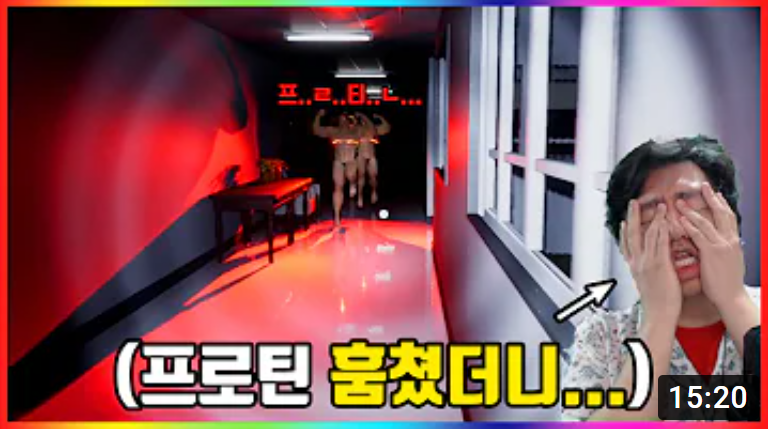

# [목차]  
1.[프로젝트명 : Hospital Runner](#프로젝트명-hospital-runner)  
2.[메인컨셉 : 공포](#메인컨셉--공포)  
3.[서브컨셉 : 추격 A.I](#서브-컨셉-1--추격-ai)  
4.[서브컨셉 : 탈출](#서브-컨셉-2--탈출)  
5.[서브컨셉 : 음악](#서브-컨셉-3--음악)  
6.[서브컨셉 : 시야제한](#서브-컨셉-4--시야-제한)  
7.[서브컨셉 : 코즈믹호러](#서브-컨셉-5--코즈믹-호러)  
8.[관련이미지](#관련-이미지--동영상)  
9.[대표이미지](#대표-이미지)  
10.[컨셉 & 대표이미지 기반 작품묘사](#컨셉--대표이미지-기반-작품묘사)   
11.[게임제목 구성 요소](#게임제목-구성-요소)  
12.[매커니즘](#1-메커니즘)  
13.[이야기](#2-이야기)  
14.[미적요소](#3-미적요소)  
15.[기술](#4-기술)  
# 프로젝트명: Hospital Runner

# [컨셉]

## 메인컨셉 : 공포

- 공포라는 컨셉으로 플레이어에게 긴장감을 준다.

### 서브 컨셉 1 : 추격 A.I 

- 플레이어를 쫓아가는 A.I.다.

### 서브 컨셉 2 : 탈출 

- 플레이어는 지정 장소를 탈출해야 한다. 

### 서브 컨셉 3 : 음악 

- 조용한 분위기 속에 무서운 음악이 들린다. 

### 서브 컨셉 4 : 시야 제한

- 플레이어의 시야를 제한한다. 

### 서브 컨셉 5 : 코즈믹 호러 

- 플레이어는 미지의 존재에게 저항할 수 없다.

  

# [관련 이미지 & 동영상]

- 이미지  
   
   
   
- 동영상  
  

  

# [대표 이미지]  

  

# [컨셉 & 대표이미지 기반 작품묘사]

> ### 대표이미지 기반 :  
- UI는 단순하게 보이게 하고 플레이어는 수집을 하여 몬스터를 피해다니면서 탈출하는게 목표이다.

> ### 컨셉 기반:
-  배경은 어두운 폐 병원입니다. 플레이어는 원인 모를 몬스터에게 쫒기게 됩니다.  
-  플레이어는 플래시를 얻어 어두운 곧을 밝게 할 수 있습니다.  
-  플레이어는 아이템을 수집에 탈출하는게 목표입니다.  
  

# [게임제목 구성 요소]

- 죽고싶지 않으면 도망가라  

 

## 1. 메커니즘

[도전 과제]

1) 몬스터를 피해 도망가라  
2) 탈출을 위해 수집해라  

[재미 요소]

1) 몬스터를 피해 다니면서 도망가는 재미가있다.  
2) 짜릿함을 얻을 수 있다.  
3) 탈출이라는 목표로 성취감을 얻을 수 있다.  

 

## 2. 이야기

[만들게 된 배경]  
2D말고 한 번 3D로 만들고 싶다는 생각이 들었습니다.3D게임에는 뭔가 공포 탈출이라는게 플레이어에게 공포와 추격당했을 시 긴장감을 줄 수 있을 거라는 생각이 들어서 만들었습니다.

[카메라 관점]  
1인칭으로 이제 플레이어가 몬스터에게 쫓기고 있을 때 얼마나 빠른지 또는 얼마 만큼 쫓아왔는지 알 수 없게 만듦으로써 플레이어를 긴장하게 할 수 있다.

 

## 3. 미적요소

[디자인]  
코즈믹 호러를 연상하게 하는 몬스터와 폐병원이라는 컨셉을 이용한다.  
[컬러]  
어두운 분위기로 플레이어는 손전등에 의존하게 된다.  
[음향]  
기본으로 으스스한 배경음과 플레이어가 쫓기고 있을 때 나오는 긴박함이 나오는 효과음이 나오게 한다. 
 

## 4. 기술

언리얼엔진5으로 깔끔한 그래픽으로 만들 것이다 
