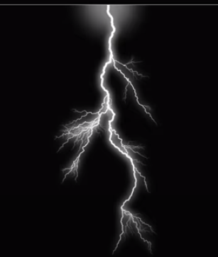

# [목차]  
1.[프로젝트명 : Hospital Runner](#프로젝트명-hospital-runner)  
2.[메인컨셉 : 공포](#메인컨셉--공포)  
3.[서브컨셉 : 추격 A.I](#서브-컨셉-1--추격-ai)  
4.[서브컨셉 : 탈출](#서브-컨셉-2--탈출)  
5.[서브컨셉 : 음악](#서브-컨셉-3--음악)  
6.[서브컨셉 : 시야제한](#서브-컨셉-4--시야-제한)  
7.[서브컨셉 : 코즈믹호러](#서브-컨셉-5--코즈믹-호러)  
8.[관련이미지](#관련-이미지--동영상)  
9.[대표이미지](#대표-이미지)  
10.[컨셉 & 대표이미지 기반 작품묘사](#컨셉--대표이미지-기반-작품묘사)   
11.[게임제목 구성 요소](#게임제목-구성-요소)  
12.[매커니즘](#1-메커니즘)  
13.[이야기](#2-이야기)  
14.[미적요소](#3-미적요소)  
15.[기술](#4-기술)  
16.[게임 시스템 디자인](#게임-시스템-디자인)  
16-1.[게임 오브젝트 분해](#1-게임-오브젝트-분해)  
16-2.[파라미터(속성) 뽑아 보기](#2-파라미터속성-뽑아-보기)  
16-3.[행동 뽑아 보기](#3-행동-뽑아-보기)  
16-4.[상태 뽑아 보기](#4-상태-뽑아-보기)  
16-5.[플레이어 캐릭터 속성(파라미터)](#5-플레이어-캐릭터-속성파라미터)  
16-6.[게임의 규칙](#6-게임의-규칙)  
17.[개발 요구사항 & 흐름도](#개발-요구사항--흐름도)  
17-1.[요구사항](#1-요구사항)  
17-2.[흐름도](#2-흐름도)  
18.[스토리보드](#스토리보드)  
19.[프로토타입 개발 요구사항 (6주개발)](#프로토타입-개발-요구사항-6주개발)  
20.[프로토타입 개발작업 일정 (6주개발)](#프로토타입-개발작업-일정-6주개발)  
 
# 프로젝트명: Hospital Runner(배용훈)

# [컨셉]

## 메인컨셉 : 공포

- 공포라는 컨셉으로 기괴한 몬스터를 넣어 플레이어에게 긴장감을 준다.

### 서브 컨셉 1 : 추격 A.I 

- 플레이어를 애간장 태우듯이 쫓아오는 A.I

### 서브 컨셉 2 : 탈출 

- 플레이어는 지정 장소를 탈출해야 한다. 

### 서브 컨셉 3 : 음악 

- 조용한 분위기 속에 무서운 음악이 들린다. 

### 서브 컨셉 4 : 시야 제한

- 플레이어의 시야를 제한한다. 

### 서브 컨셉 5 : 코즈믹 호러 

- 플레이어는 미지의 존재에게 저항할 수 없다.

  

# [관련 이미지 & 동영상]

- 이미지  
   
   
   
- 동영상  
  

  

# [대표 이미지]  

  

# [컨셉 & 대표이미지 기반 작품묘사]

> ### 대표이미지 기반 :  
- UI는 단순하게 보이게 하고 플레이어는 수집을 하여 몬스터를 피해다니면서 탈출하는게 목표이다.

> ### 컨셉 기반:
-  배경은 어두운 폐 병원입니다. 플레이어는 원인 모를 몬스터에게 쫒기게 됩니다.  
-  플레이어는 플래시를 얻어 어두운 곧을 밝게 할 수 있습니다.  
-  플레이어는 열쇠조각을 수집해 탈출하는게 목표입니다.  
  

# [게임제목 구성 요소]

- 죽고싶지 않으면 도망가라  

 

## 1. 메커니즘

[도전 과제]

1) 몬스터를 피해 도망가라  
2) 탈출을 위해 수집해라  

[재미 요소]

1) 몬스터를 피해 다니면서 도망가는 재미가있다.  
2) 짜릿함을 얻을 수 있다.  
3) 탈출이라는 목표로 성취감을 얻을 수 있다.  
4) 기록을 세울수 있다.  

 

## 2. 이야기

[만들게 된 배경]  
2D말고 한 번 3D로 만들고 싶다는 생각이 들었습니다.3D게임에는 뭔가 공포 탈출이라는게 플레이어에게 공포와 추격당했을 시 긴장감을 줄 수 있을 거라는 생각이 들어서 만들었습니다.

[카메라 관점]  
1인칭으로 이제 플레이어가 몬스터에게 쫓기고 있을 때 얼마나 빠른지 또는 얼마 만큼 쫓아왔는지 알 수 없게 만듦으로써 플레이어를 긴장하게 할 수 있다.

 

## 3. 미적요소

[디자인]  
코즈믹 호러를 연상하게 하는 몬스터와 폐병원이라는 컨셉을 이용한다.  
[컬러]  
어두운 분위기로 플레이어는 손전등에 의존하게 된다.  
[음향]  
기본으로 으스스한 배경음과 플레이어가 쫓기고 있을 때 나오는 긴박함이 나오는 효과음이 나오게 한다. 
 

## 4. 기술

언리얼엔진5으로 깔끔한 그래픽으로 만들 것이다  

 

# [게임 시스템 디자인]
## 1. 게임 오브젝트 분해  

|연번|오브젝트 이름(영문이름)|오브젝트 이미지|
|:---:|:---:|:---:|  
|1|사람(Player)||  
|2|비(rain)||  
|3|번개(thunder)||  
|4|밤(night)||  
|5|기록(stopwatch)||  
|6|병원(hospital)||  
|7|핸드폰플래시(phone_flash)||  
|8|열쇠 조각(key_piece)||  
|9|열 수 있는 문(open_door)||  
|10|열 수 없는 문(closed_door)||  
|11|빨라지는 아이템(speed_item)||  
|12|투명해지는 아이템(transpraent_item)||  
|13|귀신1(ghost_1)||  
|14|귀신2(ghost_1)||  
|15|소리나고 느려지는 함정(soundslow_trap)||  
|16|케비넷(cabinet_hide)||  
|17|침대(bed_hide)||  
|18|의자 밑(chair_hide)||  
|19|창문(window)||  

## 2. 파라미터(속성) 뽑아 보기
1) 오브젝트 이름: player  

|속성|영문명칭|설명|비고|
|:---:|:---:|:---:|:---:|
|속도|player_sp|플레이어 이동속도|.|
|상태|player_st|플레이어가 걷는지, 뛰는지, 숨는지 등|.|
|개수|player_num|플레이어가 가진 열쇠 갯수|.|

2) 오브젝트 이름: ghost_1  

|속성|영문명칭|설명|비고|
|:---:|:---:|:---:|:---:|
|속도|G1_sp|귀신1의 이동속도|.|
|상태|G1_st|플레이어가 무엇을 하는지 판별|소리 판별|
 
3) 오브젝트 이름: ghost_2  

|속성|영문명칭|설명|비고|
|:---:|:---:|:---:|:---:|
|속도|G2_sp|귀신2의 이동속도|.|
|상태|G2_st|플레이어가 무엇을 하는지 판별|빛 판별|

## 3. 행동 뽑아 보기
1) 오브젝트 이름: player  

|행동|영문 명칭|설명|
|:---:|:---:|:---:|
|앞으로 이동|front_move|플레이어가 앞으로 이동|
|뒤로 이동|back_move|플레이어가 뒤로 이동|
|왼쪽 이동|left_move|플레이어가 왼쪽으로 이동|
|오른쪽 이동|right_move|플레이어가 오른쪽으로 이동|
|앉기|sit|플레이어 앉기|
|뛰기|run|플레이어 뛰기|
|빛 비추기|light_on|플레이어가 빛을 비추기|
|빛 끄기|light_off|플레이어가 빛을 끄기|
|상호작용|action|플레이어가 아이템을 줍거나, 숨기|

2) 오브젝트 이름 : ghost_1, ghost_2

|행동|영문 명칭|설명|
|:---:|:---:|:---:|
|맵 이동|map_roaming|귀신들이 맵을 돌아다님|
|플레이어 쫓아다니기|follow_pl|귀신이 근처에 플레이어를 만나면 쫓아다님|
|플레이어 죽이기|kill_pl|플레이어를 닿게 되면 게임 끝|

## 4. 상태 뽑아 보기
1) 오브젝트 이름: player  

|현상태|전이상태|전이조건|
|:---:|:---:|:---:|
|가만히 있기|가만히 있기|아무 행동을 하지 않음|
|가만히 있기|앞으로 이동|w키 입력|
|가만히 있기|아래로 이동|s키 입력|
|가만히 있기|왼쪽으로 이동|a키 입력|
|가만히 있기|오른쪽으로 이동|d키 입력|
|가만히 있기|앉기|Ctrl키 입력|
|가만히 있기|플래시 비추기|F키 입력|
|플래시 비추기|플래시 끄기|F키 입력|
|가만히 있기|상호작용|E키 입력|

2) 오브젝트 이름 : ghost_1

|현상태|전이상태|전이조건|
|:---:|:---:|:---:|
|맵 이동|맵 이동|게임을 시작하면 움직임|
|맵 이동|빨라지면서 이동|플레이어가 뛰면|
|맵 이동|플레이어를 쫓아다님|플레이어 발견시|
|플레이어를 쫓아다님|맵 이동|플레이어가 시야에 벗어 날 시|

3) 오브젝트 이름 : ghost_2

|현상태|전이상태|전이조건|
|:---:|:---:|:---:|
|맵 이동|맵 이동|게임을 시작하면 움직임|
|맵 이동|빨라지면서 이동|플레이어가 플래시를 비추면|
|맵 이동|플레이어를 쫓아다님|플레이어 발견시|
|플레이어를 쫓아다님|맵 이동|플레이어가 시야에 벗어 날 시|

## 5. 플레이어 캐릭터 속성(파라미터)

|속성|영문명칭|설명|비고|
|:---:|:---:|:---:|:---:|
|걷기|walk|플레이어가 걷는다.|.|
|뛰기|run|플레이어가 뛴다.|.|
|앉기|sit|플레이어가 앉는다.|.|
|숨기|hide|플레이어가 숨는다.|.|
|빛 비추기|light|플레이어가 어두운 곳을 비춘다./끄다.|.|

## 6. 게임의 규칙

1) 핵심 규칙  
플레이어는 1인칭 시점으로 병원을 탈출한다.  
병원을 탈출하는 과정에서 몬스터를 피해 다니며 열쇠 조각을 찾는다.  

2) 보조 규칙  
플레이어는 몬스터가 안 보이는 곳에 앉거나 숨을 수 있는 가구에 숨는다.  
타이머가 있어 얼마나 빨리 탈출 하거나, 나와의 경쟁에서 더 빨리 탈출할 수 있는지 경쟁할 수 있다.  

# [개발 요구사항 & 흐름도]
## 1. 요구사항

* 시작화면, 기록, 게임화면, 설정 화면이 있다.
* 시작화면에는, 시작하기와 기록, 설정, 종료 버튼이 있다.  
* 설정을 누르면 설정화면으로 넘어간다.
* 설정화면에는 밝기, 소리, 마우스 감도 설정을 한다.  
* 설정화면에는 돌아가기 버튼이 있고 시작화면으로 이동한다.  
* 기록을 누르면 기존에 등록한 하이스코어 10개를 보여준다.  
* 기록화면에는 돌아가기 버튼이 있고 시작화면으로 이동한다.  
* 시작화면에 시작하기를 누르면 게임화면으로 변경된다.  
* 게임 시작화면 좌측 상단에 열쇠 개수, 타이머가 표시된다.  
* esc키를 누르면 일시정지/메뉴키가 열린다. 여기서 설정, 메인화면, 게임종료를 할 수 있다.
* wasd가 방향키가 되고 ctrl누르면 앉기, shift누르면 달리기가 된다.  
* E키가 상호작용으로 열쇠를 줍거나 특정 사물에 숨을 수 있다.  
* F키로는 플래시를 껐다 켰다 할 수 있다.  
* 소리나고 느려지는 함정 만든다.  
* 빨라지는 아이템과, 은신 아이템을 만든다.  
* 시간을 밤, 날씨는 비가 오게한다.  
* 병원을 만든다.(2~3층)(방은 10개 이상 정도 예상) 
* 상호작용 아이템, 액티브 아이템(빨라지는 아이템, 은신 아이템)을 배치한다.  
* 주변 장식 오브젝트 배치한다.  
* 몬스터1 빛에 반응한다.
* 몬스터2 소리에 반응한다.
* 클리어 조건은 열쇠를 다 모은후에 탈출 하는 방법이다.  
* 클리어 후 기록에 저장한다.
* 애니메이션 효과  
* 시네마틱 제작  
* 플레이어 카메라 흔들림 설정  
* 

## 2. 흐름도

# [스토리보드]

# [프로토타입 개발 요구사항 (6주개발)]

## 1주차
### 플레이어 이동 구현
* wasd가 방향키가 되고 ctrl누르면 앉기, shift누르면 달리기가 된다.  

## 2주차
### 상호작용, 함정 구현
* E키가 상호작용으로 열쇠를 줍거나 특정 사물에 숨을 수 있다.  
* F키로는 플래시를 껐다 켰다 할 수 있다.  
* 소리나고 느려지는 함정 만든다.  

## 3주차
### AI와, AI에 반응하는 아이템 구현
* 몬스터1 빛에 반응한다.
* 몬스터2 소리에 반응한다.
* 빨라지는 아이템과, 은신 아이템을 만든다.  

## 4주차
### 배경과, 날씨, 배치 
* 시간을 밤, 날씨는 비가 오게한다.  
* 병원을 만든다.(2~3층)(방은 10개 이상 정도 예상)     
* 상호작용 아이템, 액티브 아이템(빨라지는 아이템, 은신 아이템)을 배치한다.  
* 주변 장식 오브젝트 배치한다.  

## 5주차
### UI와 게임설정
* 시작화면, 기록, 게임화면, 설정 화면이 있다.  
* 시작화면에는, 시작하기와 기록, 설정, 종료 버튼이 있다.  
* 설정을 누르면 설정화면으로 넘어간다.  
* 설정화면에는 밝기, 소리, 마우스 감도 설정을 한다.  
* 설정화면에는 돌아가기 버튼이 있고 시작화면으로 이동한다.  
* 시작화면에 시작하기를 누르면 게임화면으로 변경된다.  
* 게임 시작화면 좌측 상단에 열쇠 개수, 타이머가 표시된다.  
* esc키를 누르면 일시정지/메뉴키가 열린다. 여기서 설정, 메인화면, 게임종료를 할 수 있다.  

## 6주차
### 게임클리어, 기록
* 클리어 조건은 열쇠를 다 모은후에 탈출 하는 방법이다.  
* 클리어 후 기록에 저장한다.  
* 기록을 누르면 기존에 등록한 하이스코어 10개를 보여준다.  

# [프로토타입 개발작업 일정 (6주개발)]

## 1주차
작업명 : 플레이어 이동 구현  
해당 요구사항 : 이동 구현  

1) wasd이동 (100%)  
2) 앉기와 달리기 구현 (100%)  
작업 내용 : W(앞) S(뒤) A(왼) D(오) 구현과 ctrl시 앉기 shift시 달리기 구현  

<video width="100%" height="100%" controls="controls">
  <source src="/video/1주차.mp4" type="video/mp4">
</video>  

## 2주차
작업명 : 상호작용, 함정 구현  

해당 요구사항 :  

E키가 상호작용으로 열쇠를 줍거나 특정 사물에 숨을 수 있다.  
F키로는 플래시를 껐다 켰다 할 수 있다.  
소리나고 느려지는 함정을 만든다.  
작업 내용 :  

열쇠 앞에 E키를 누르면  열쇠를 주을수 있다. (100%)  
특정 사물에 E키를 누르면 숨을 수 있다. (100%)  
F키를 누르면 플래시를 껐다 켰다 할 수 있다. (100%)  
소리가 나고 느려지는 함정을 만든다.(100%)  
------추가-----  
  
크로스헤어  
열쇠 수집시 왼쪽상단에 표시  
<video width="100%" height="100%" controls="controls">
 <source src="/video/2주차.mp4" type="video/mp4">
</video>  

## 3주차
## 4주차
## 5주차
## 6주차
